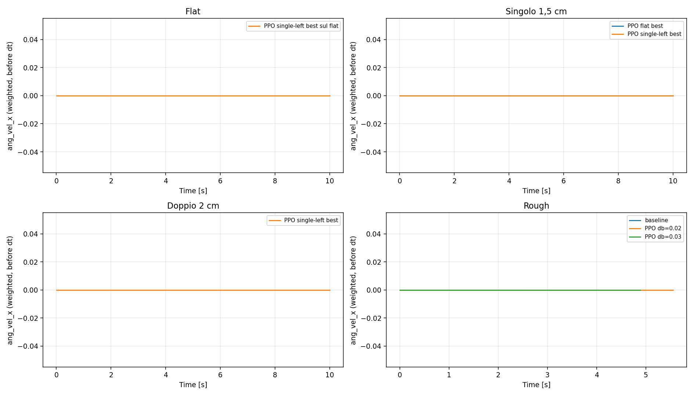
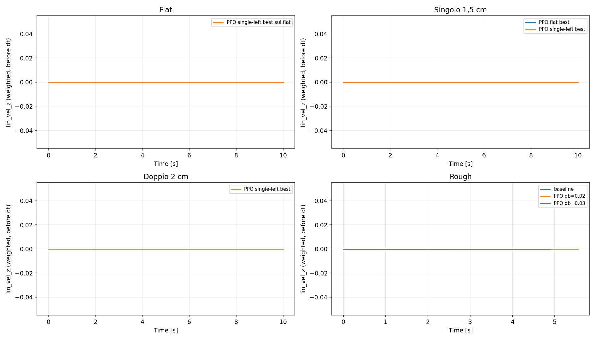
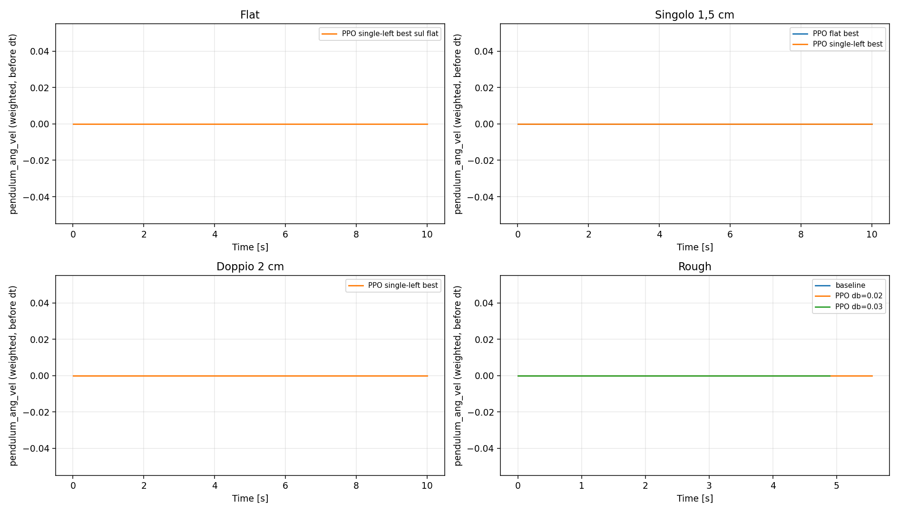
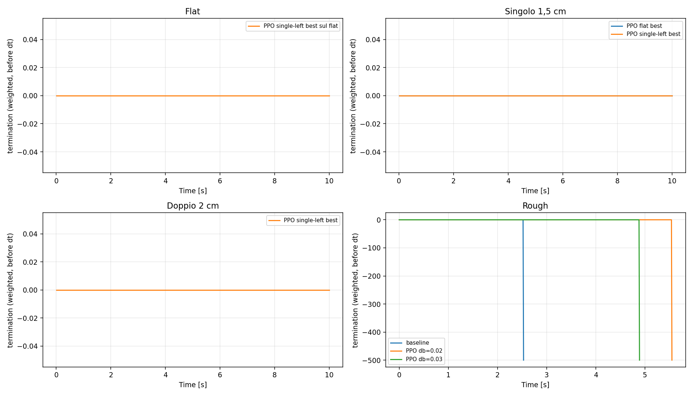
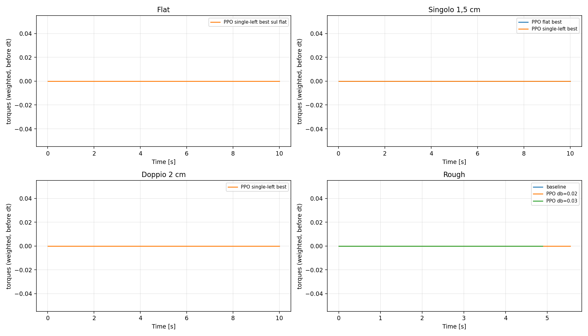
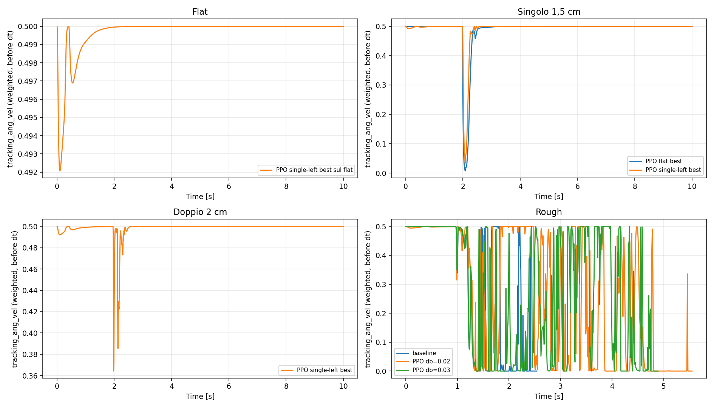
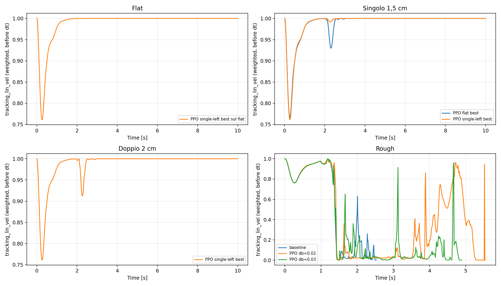
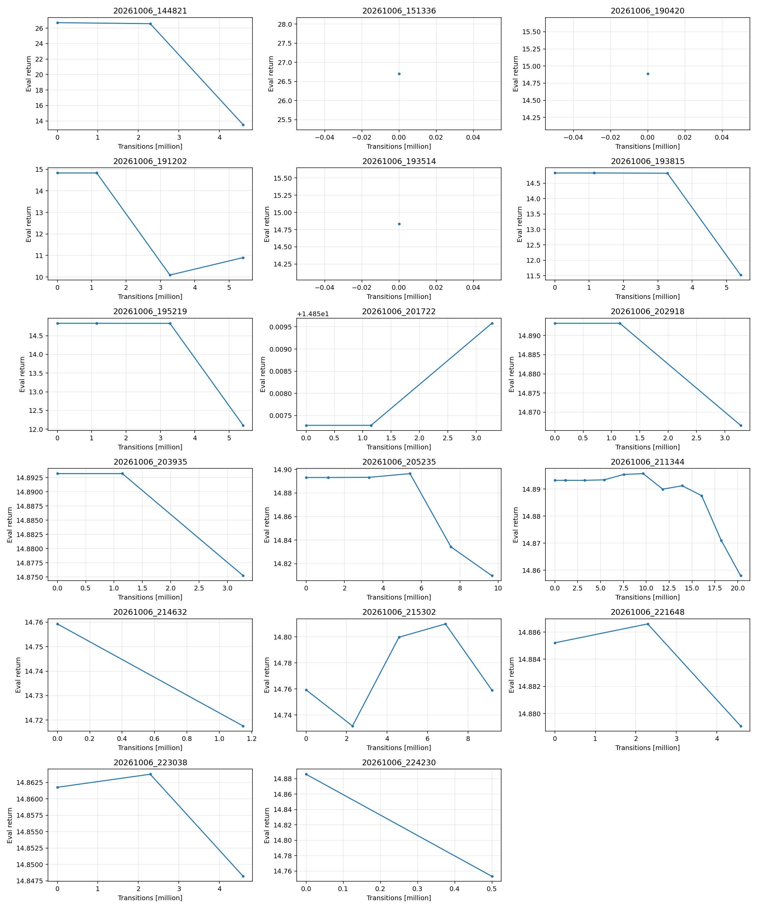
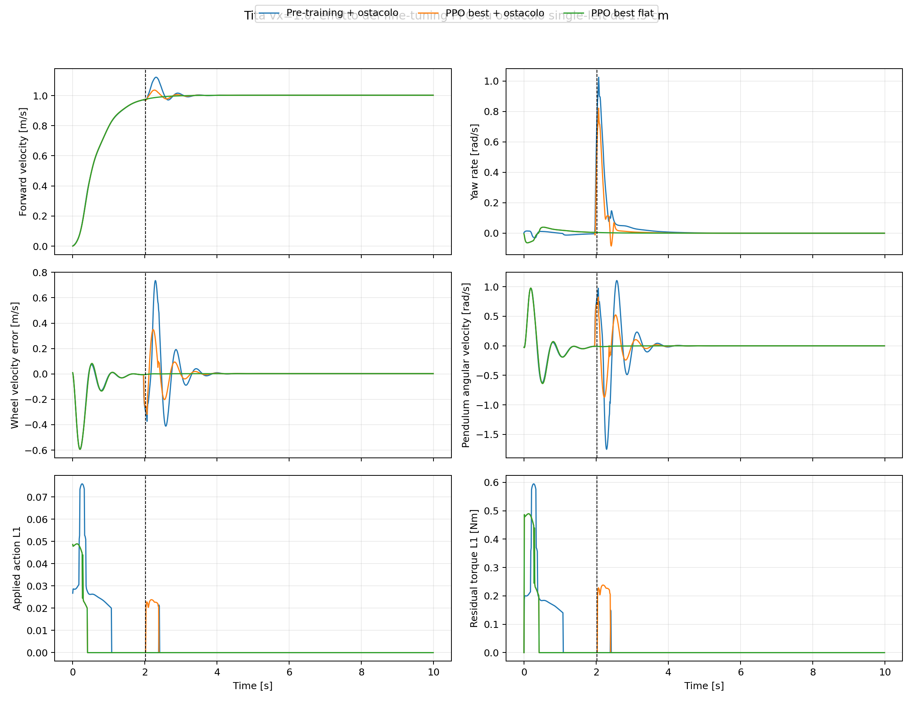

# Tita residual RL: sviluppo del setup di training

<!-- SAVED_REWARD_COMPARISON -->
## Grafici delle singole reward — confronto delle prove salvate

Aggiornato il 7 ottobre 2026, solo dai dati esistenti: nessun nuovo training o rollout. Questi sono i **contributi realmente registrati con gli scaling di ogni prova**, non reward attivate retroattivamente.

Ogni figura confronta lo stesso termine in quattro pannelli: flat, singolo, doppio e rough. Le reward disattivate sono correttamente piatte a zero: non vengono nascoste. Il confronto dei nuovi scaling balance ricalcolati sugli stessi stati è separato nello [studio rough](../analysis_tita/rough_reward_study.md).

**Limiti dei dati:** il best del training flat non ha qui un rollout flat identificato: il suo CSV di evaluation è stato sovrascritto dalla valutazione sul singolo. Il flat disponibile è il best single-left rivalutato senza ostacoli. Sul doppio il CSV disponibile è la policy single-left su 2 cm, non il best dei successivi fine-tuning PPO/SAC. Per questi run sono conservati i totali delle eval, non le componenti temporali. Nessuna curva mancante è ricostruita o attribuita a un altro checkpoint.

I CSV `rollout_info.csv` iniziano al primo step, **t=0,01 s**; i CSV rough includono t=0. Non aggiungo uno zero artificiale. Ordinata: componente pesata prima di dt=0,01; il costo terminale −500 equivale a −5 nel ritorno del passo. Durate diverse non implicano qualità migliore: sul rough tutte le prove cadono.

### Dati effettivamente confrontati

| Scenario | Policy / controllo | Return somma componenti | Durata |
|---|---|---:|---:|
| Flat | PPO single-left best sul flat | 14.891522 | 10.00 s |
| Singolo 1,5 cm | PPO flat best | 14.759251 | 10.00 s |
| Singolo 1,5 cm | PPO single-left best | 14.809913 | 10.00 s |
| Doppio 2 cm | PPO single-left best | 14.861770 | 10.00 s |
| Rough | baseline | -2.882566 | 2.53 s |
| Rough | PPO db=0.02 | -1.410386 | 5.55 s |
| Rough | PPO db=0.03 | -2.138272 | 4.89 s |

[CSV con contributi cumulati per termine](assets/reward_comparisons/episode_components.csv) · [Inventario delle sorgenti](assets/reward_comparisons/rollout_inventory.csv)

### action_rate


### action_rate_2nd


### ang_vel_x



### ang_vel_y


### base_height


### cog_vel_z


### dof_pos_limits


### energy


### lin_vel_z



### orientation


### pendulum_ang_vel



### residual_torque


### stance_width


### termination



### torques



### tracking_ang_vel



### tracking_lin_vel



### wheel_vel_tracking


### Tutti i run: andamento della reward totale nelle eval

I valori sono quelli originali. I run iniziali avevano guadagni e/o reward differenti; non confrontare valori assoluti di configurazioni diverse come se misurassero lo stesso obiettivo.



| Run | Scenario documentato | Eval salvate | Best return | Ultimo return |
|---|---|---:|---:|---:|
| 20261006_144821 | Setup precedente: vedi log del run | 3 | 26.702623 | 13.507003 |
| 20261006_151336 | Setup precedente: vedi log del run | 1 | 26.702624 | 26.702624 |
| 20261006_190420 | Setup precedente: vedi log del run | 1 | 14.887959 | 14.887959 |
| 20261006_191202 | Setup precedente: vedi log del run | 5 | 14.831635 | 10.901354 |
| 20261006_193514 | Setup precedente: vedi log del run | 1 | 14.831635 | 14.831635 |
| 20261006_193815 | Setup precedente: vedi log del run | 5 | 14.831635 | 11.520868 |
| 20261006_195219 | Setup precedente: vedi log del run | 5 | 14.831635 | 12.101879 |
| 20261006_201722 | Setup precedente: vedi log del run | 4 | 14.859580 | 14.859580 |
| 20261006_202918 | Setup precedente: vedi log del run | 4 | 14.893193 | 14.866560 |
| 20261006_203935 | Setup precedente: vedi log del run | 4 | 14.893193 | 14.875246 |
| 20261006_205235 | Flat, db 0,01 | 7 | 14.896503 | 14.809825 |
| 20261006_211344 | Flat, db 0,02 | 12 | 14.895682 | 14.858019 |
| 20261006_214632 | Singolo, resume con warmup | 2 | 14.759276 | 14.717590 |
| 20261006_215302 | Singolo, resume senza warmup | 5 | 14.809917 | 14.759072 |
| 20261006_221648 | Doppio 1,5 cm PPO | 3 | 14.886603 | 14.879085 |
| 20261006_223038 | Doppio 2 cm PPO | 3 | 14.863760 | 14.848204 |
| 20261006_224230 | Doppio 2 cm SAC | 2 | 14.885916 | 14.753070 |

### Archivio completo delle altre prove

[Grafici di tutte le componenti degli altri 25 rollout salvati](assets/reward_comparisons/archive.md), inclusi vecchia baseline con/senza ostacoli e prime policy SAC. Sono tenuti separati perché cambiano controller, scaling e durata.

<!-- END_SAVED_REWARD_COMPARISON -->

Aggiornato: 6 ottobre 2026.

Questo report raccoglie le modifiche che hanno reso stabile il training residuale
di Tita a `vx=1.0 m/s`, i test che non hanno funzionato e il protocollo usato per
passare dal terreno piatto agli ostacoli. L'obiettivo sul piatto non è ottenere
un'azione matematicamente nulla a ogni step, ma conservare il comportamento della
baseline MPC/WBC e impedire che piccole uscite asimmetriche della rete generino yaw
o degradino il tracking.

## Setup selezionato

| Voce | Valore |
|---|---:|
| Algoritmo iniziale | PPO |
| Comando | rampa LPF verso `[vx, wz] = [1.0, 0.0]` |
| Environment | 1024 train, 128 eval |
| Rete actor | ELU, `(512, 256, 128)`, uscita `tanh_normal` |
| Rete critic | ELU, `(512, 256, 128)` |
| Action space | 8: sei giunti delle gambe e due ruote |
| Init deviazione standard | `0.03` |
| Entropia PPO | `0.0` |
| Action prior | media di `action_raw²`, costo `20.0` |
| Deadband per neurone | `0.02` sull'azione normalizzata |
| Warm-up critic | `1,000,000` step richiesti sui run nuovi; disattivato sui resume |
| Osservazione actor | 34 elementi |
| Osservazione critic | privileged state, 85 elementi |
| Rumore e randomizzazione | disabilitati nello studio iniziale |
| Reward iniziale | solo tracking lineare `1.0` e angolare `0.5` |

La shape mantiene tre layer. `(512, 256, 128)` è stata conservata perché, con la
deadband corretta, non mostra instabilità numerica e mantiene capacità per la
manovra sull'ostacolo. `(256, 256, 128)` resta il confronto successivo se
ricompaiono asimmetrie o overfitting; non si cambia shape insieme a un'altra
variabile, per poter attribuire il risultato.

## Controllore residuale verificato

Nominale e residuo usano gli stessi guadagni. Per ogni attuatore:

```text
q_des_rl  = q_des_wbc  + action_applied * scale_pos
dq_des_rl = dq_des_wbc + action_applied * scale_vel

tau_total = tau_ff
          + Kp * (q_des_rl  - q)
          + Kd * (dq_des_rl - dq)
```

Equivalentemente:

```text
tau_nominal = tau_ff + Kp*(q_des_wbc-q) + Kd*(dq_des_wbc-dq)
tau_rl      = Kp*(action_applied*scale_pos)
            + Kd*(action_applied*scale_vel)
tau_total   = tau_nominal + tau_rl
```

Questa forma garantisce `action=0 -> tau_rl=0` esattamente. L'azione non viene
sommata dentro MPC/WBC e poi una seconda volta nel controllo. I vecchi guadagni
nominali separati `35/10` erano codice morto e sono stati rimossi.

Configurazione corrente:

```text
scale_pos = [0.20, 0.35, 0.50, 0.0] * 2 rad
scale_vel = [0.0, 0.0, 0.0, 5.0] * 2 rad/s
Kp        = [20.0, 20.0, 20.0, 0.0] * 2
Kd        = [1.0, 1.0, 1.0, 0.0] * 2
Kd_wheel  = [0.0, 0.0, 0.0, 2.0] * 2
```

Le ruote hanno lo stesso verso d'asse nel modello: lo stesso segno di velocità
porta entrambe in avanti; segni opposti producono yaw.

## Cosa ha migliorato il training flat

### Inizializzazione dell'ultimo layer a zero

Il kernel di uscita dell'actor parte esattamente a zero. Con la distribuzione
PPO, la media deterministica iniziale è quindi zero. `INIT_STD=0.03` conserva
esplorazione stocastica nel training senza disturbare la valutazione
deterministica.

### Warm-up del critic

Nel warm-up i gradienti dell'actor sono azzerati, mentre critic e normalizzatore
delle osservazioni continuano ad aggiornarsi. Nel run flat con deadband `0.02`, a
`1,146,880` step:

- reward deterministica: `14.893`;
- action mean, RMS e massimo: tutti `0.0000`;
- flag `critic_warmup_active=1.0`.

Dopo questa eval l'actor viene sbloccato e PPO torna ad aggiornare actor e critic.
La seconda eval allo stesso numero di step è la valutazione iniziale della nuova
fase, non un ulteriore checkpoint indipendente.

Il warm-up non viene ripetuto sui resume (`PPO_CRITIC_WARMUP_ON_RESTORE=False`).
Congelare i pesi dell'actor non congela infatti il suo comportamento se il
normalizzatore continua ad aggiornarsi. Nel primo tentativo di resume
`single_left`, la reward è passata da `14.759` a `14.718` durante il solo
warm-up: le action mean/RMS erano cambiate pur avendo gradienti actor nulli.
Quel tentativo è stato interrotto e scartato. Su una policy già addestrata si
mantengono quindi insieme pesi e statistiche caricate, e actor e critic vengono
aggiornati normalmente dal primo batch del nuovo task.

### Action prior direttamente nella loss

La loss aggiunge:

```text
LOSS_NN_ACTION_COST * mean(action_deterministic_raw²)
```

con costo `20.0`. L'azione usata è l'uscita normalizzata della rete prima delle
scale fisiche e prima della deadband. Il gradiente continua quindi a spingere la
rete verso zero anche quando il controllo applicato viene azzerato dal filtro.
Questo è più diretto di una penalità inserita nella reward, che passerebbe da
critic, GAE e normalizzazione dei vantaggi.

### Osservazione actor ridotta

Sono stati esclusi inizialmente:

- `balance_errors` (2 valori);
- `tau_ff` (8 valori);
- `tau_rl` (8 valori).

L'actor è passato da 52 a 34 ingressi e il privileged state da 103 a 85. Questo
ha ridotto la degradazione iniziale, evitando segnali quasi deterministici e
fortemente correlati. Verranno reintrodotti uno alla volta sull'ostacolo soltanto
se forniscono un vantaggio misurabile.

### Deadband per singolo neurone

La deadband viene applicata componente per componente:

```text
action_applied[i] = 0                         se abs(action_raw[i]) < deadband
action_applied[i] = action_raw[i]             altrimenti
```

`policy_action` conserva l'uscita grezza per diagnostica e loss;
`applied_action` registra il comando realmente applicato. La soglia `0.02`
corrisponde, al bordo, a circa:

| Giunto | Offset | Coppia proporzionale |
|---|---:|---:|
| hip | `0.004 rad` | `0.08 Nm` |
| thigh | `0.007 rad` | `0.14 Nm` |
| knee | `0.010 rad` | `0.20 Nm` |
| wheel | `0.10 rad/s` | `0.20 Nm` |

La funzione è una zona morta, non attenua le azioni sopra soglia.

## Confronto quantitativo sul flat

Baseline pura con i guadagni condivisi: `14.893 / 15`, deterministica per 10 s.

### Deadband `0.01`

Run: `checkpoints/TitaJoystickFlatTerrain/20261006_205235`.

| Step | Reward | NN action L2 | Esito |
|---:|---:|---:|---|
| 3,276,800 | 14.893 | 0.000070 | nominale |
| 5,406,720 | 14.897 | 0.000355 | lieve miglioramento |
| 7,536,640 | 14.834 | 0.000962 | inizio deriva |
| 9,666,560 | 14.810 | 0.001301 | sotto il limite dello 0.5% |

La soglia `0.01` filtrava hip e ruote, ma lasciava passare abbastanza rumore su
thigh e knee da ricreare correzioni asimmetriche.

### Deadband `0.02`

Run: `checkpoints/TitaJoystickFlatTerrain/20261006_211344`.

| Step | Reward | NN action L2 |
|---:|---:|---:|
| 3,276,800 | 14.893 | 0.000065 |
| 5,406,720 | 14.893 | 0.000267 |
| 7,536,640 | 14.895 | 0.000820 |
| 9,666,560 | **14.896** | 0.000923 |
| 11,796,480 | 14.890 | 0.000805 |
| 13,926,400 | 14.891 | 0.000883 |
| 16,056,320 | 14.888 | 0.001182 |
| 18,186,240 | 14.871 | 0.001016 |
| 20,316,160 | 14.858 | 0.000833 |

La deadband `0.02` elimina la deriva rapida vista con `0.01`. L'ultima policy è
ancora entro `0.24%` dalla baseline, ma il miglior checkpoint è quello a
`9,666,560` step con ritorno `14.895682`. Per questo il criterio di salvataggio
usa il massimo ritorno deterministico e il passaggio all'ostacolo parte da
`params_best`, non da `params_final`.

## Osservazioni normalizzate

Il clipping delle osservazioni normalizzate è sceso sotto l'1% durante gli
update dell'actor e fino a circa `0.06-0.14%` nelle eval tarde. Non ci sono NaN
né saturazioni diffuse. La normalizzazione poteva amplificare una deviazione già
presente, ma i dati non la indicano come causa primaria della vecchia caduta di
reward; la causa dominante era l'effetto fisico delle piccole azioni
asimmetriche.

## Passaggio all'ostacolo singolo

Il codice accetta ora:

```text
--obstacle single_left
--obstacle double
--obstacle multi
```

Senza il flag, gli ostacoli sono disabilitati. `single_left` crea una box fissa:

- altezza `1.5 cm`;
- lunghezza `30 cm`;
- larghezza `20 cm`;
- centro a `[1.5, stance_width/2] = [1.5, 0.2835] m`.

Con `randomize_reset=0.0` tutti gli environment iniziano da `x=y=0`, quindi la
box è allineata alla sola corsia sinistra. Lo smoke test ha confermato posizione
e dimensioni del geom.

Il primo tentativo di fine-tuning PPO è partito da `params_best` del flat:

```text
checkpoints/TitaJoystickFlatTerrain/20261006_214632
```

La valutazione iniziale sullo step singolo è `14.759`, contro `14.896` del best
flat. L'urto produce quindi un segnale misurabile senza causare un collasso
immediato. Il tentativo ha inoltre mostrato che il warm-up su resume non è
trasparente a causa del normalizzatore; il run valido viene pertanto riavviato
dal medesimo checkpoint con warm-up-on-restore disabilitato.

### Risultato del fine-tuning PPO valido

Run valido, senza warm-up su restore:

```text
checkpoints/TitaJoystickFlatTerrain/20261006_215302
```

| Step | Reward single-left | NN action L2 | Nota |
|---:|---:|---:|---|
| 0 | 14.759 | n/a | best flat caricato |
| 2,293,760 | 14.732 | 0.001186 | primo update peggiora |
| 4,587,520 | 14.800 | 0.000956 | recupero e nuovo best |
| 6,881,280 | **14.810** | 0.000866 | best selezionato |
| 9,175,040 | 14.759 | 0.000837 | ritorno al valore iniziale; run fermato |

Il best a `6,881,280` step è stato valutato anche senza ostacolo: `14.892`,
contro `14.893` della baseline pura. Il fine-tuning migliora quindi il contatto
senza disturbare in modo misurabile il regime flat.



Il contatto è centrato attorno a `t=2.02 s`. Rispetto al checkpoint flat prima
del fine-tuning, nella finestra `1.82-2.62 s`:

| Metrica | Pre-training | PPO best | Variazione |
|---|---:|---:|---:|
| yaw-rate RMS | 0.428 rad/s | 0.308 rad/s | -28% |
| picco yaw-rate | 1.025 rad/s | 0.822 rad/s | -20% |
| errore velocità ruote RMS | 0.359 m/s | 0.189 m/s | -47% |
| velocità angolare pendolo RMS | 0.871 rad/s | 0.477 rad/s | -45% |
| reward lineare episodio | 9.880 | 9.893 | +0.013 |
| reward angolare episodio | 4.879 | 4.917 | +0.038 |

Dopo `t=2.62 s`, lo yaw-rate RMS passa da `0.0126` a `0.0032 rad/s` e
la coppia residuale torna esattamente a zero su tutti gli attuatori. Durante
l'urto il best usa soprattutto:

- knee sinistro: azione massima `0.0204`, circa `0.204 Nm`;
- ruota destra: azione massima `0.0238`, circa `0.238 Nm`.

Le altre azioni delle gambe restano sotto deadband. Sul flat, hip/thigh/knee
sono azzerati per tutto il rollout; le sole azioni ruota sopra soglia compaiono
brevemente nel transitorio della rampa. Il comportamento ottenuto è quindi
residuale: lascia lavorare la baseline a regime, interviene poco durante il
disturbo e torna a zero.

Artefatti:

- [video PPO best con single-left](../checkpoints/TitaJoystickFlatTerrain/20261006_215302/evaluation_single_left/rollout.mp4)
- [video slow motion single-left](../checkpoints/TitaJoystickFlatTerrain/20261006_215302/evaluation_single_left/rollout_slowed_x4.mp4)
- [grafici e CSV single-left](../checkpoints/TitaJoystickFlatTerrain/20261006_215302/evaluation_single_left/evaluation_plots)
- [video dello stesso checkpoint sul flat](../checkpoints/TitaJoystickFlatTerrain/20261006_215302/evaluation_flat/rollout.mp4)
- [grafici e CSV flat](../checkpoints/TitaJoystickFlatTerrain/20261006_215302/evaluation_flat/evaluation_plots)

## Piano di tuning e criteri di accettazione

Ogni checkpoint addestrato sull'ostacolo viene valutato sia con box attiva sia
su terreno piatto. Una policy è accettata soltanto se:

1. migliora tracking e recupero dopo il contatto;
2. non introduce azioni persistenti, yaw o perdita rilevante sul flat;
3. usa azioni correlate temporalmente all'urto e torna vicino alla baseline;
4. non dipende soltanto dal tempo fisso dell'ostacolo.

Ordine degli interventi:

1. PPO, osservazione ridotta, tracking-only, ostacolo fisso `single_left`;
2. reintroduzione dei soli `balance_errors` se lo stato corrente non basta;
3. `tau_ff` e `tau_rl` aggiunte separatamente e solo se migliorano il risultato;
4. reward di balance se il tracking dà un segnale troppo tardivo o ambiguo;
5. tuning isolato di scale, `Kp/Kd`, deadband e, solo con evidenza laterale,
   stance width;
6. piccola variazione della posizione dell'ostacolo per evitare una politica
   temporizzata;
7. ostacolo doppio;
8. confronto PPO/SAC sullo stesso protocollo.

Se il contatto utile è troppo raro per PPO oppure il miglioramento non compare
con un budget ragionevole, si passa a SAC. SAC può riutilizzare più volte le
transizioni rare tramite replay buffer; il confronto deve mantenere invariati
ambiente, reward, osservazioni, action prior e criteri di valutazione.

## Ostacolo doppio e confronto PPO/SAC

L'altezza degli ostacoli `single_left` e `double` è ora configurabile con:

```text
--obstacle-height METERS
```

Il valore viene salvato in `sparse_obstacles.height`. Il default resta `0.015 m`.

### Double da 1.5 cm

Il best single-left ottiene già `14.885` sul double da 1.5 cm, contro `14.892`
flat. Il margine è soltanto `0.007`. Un breve fine-tuning PPO ha prodotto:

| Step | Reward |
|---:|---:|
| 0 | 14.885 |
| 2,293,760 | 14.887 |
| 4,587,520 | 14.879 |

Il guadagno massimo `+0.002` non è sufficiente per attribuire una nuova abilità
alla policy. Il gradino simmetrico basso è già risolto dal MPC/WBC.

### Double da 2 cm

Sul double da 2 cm, il best single-left ottiene `14.862`: reward lineare
`9.877`, reward angolare `4.984`. Il contatto simmetrico penalizza quasi solo la
velocità in avanti.

Il fine-tuning PPO (`20261006_223038`) non ha prodotto un miglioramento stabile:

| Step | Reward |
|---:|---:|
| 0 | 14.862 |
| 2,293,760 | 14.864 |
| 4,587,520 | 14.848 |

La policy single-left non è però il riferimento migliore per il double. Un
actor SAC inizializzato esattamente a zero misura la baseline pura a `14.886`:
il residuo specializzato sul contatto asimmetrico stava togliendo circa `0.024`
punti sul gradino simmetrico. Anche a 2 cm il controllore nominale lascia quindi
solo `0.007` punti rispetto al flat.

### Prova SAC 8D

Run: `checkpoints/TitaJoystickFlatTerrain/20261006_224230`.

Per il confronto, SAC è stato portato da 6 a 8 azioni
(`leg_only_actions=False`), mantenendo rete `(512,256,128)`, ELU,
`tanh_normal`, deadband `0.02`, reward tracking-only e action prior `20`.

Il burn-in SAC ha verificato correttamente le proprietà previste:

- actor, alpha e relativi stati Adam congelati;
- mean action L2 e action-prior loss esattamente zero;
- critic e normalizzatore aggiornati;
- sblocco a `200,000` transizioni per `max_blocks`, con variazione relativa Q
  ancora `3.76%` (non per raggiungimento della soglia `1%`);
- dopo lo sblocco, actor e critic aggiornati insieme e action-prior loss positiva.

Il soft-Q molto negativo durante il burn-in non era un errore di segno. Con
`std=0.03` la log-density iniziale è alta; Brax usa il target
`Q_next - alpha*log_prob`, quindi il soft-Q può diventare negativo con
`alpha=0.1`. Dopo lo sblocco alpha è sceso fino all'ordine di `1e-3` e il Q è
tornato verso valori meno negativi.

Il risultato deterministico non è però utile:

| Step | Reward SAC double 2 cm |
|---:|---:|
| 0 | **14.886** |
| 500,000 | 14.753 |

SAC richiede circa 20 minuti per 500k transizioni con 10 collector e degrada la
baseline di `0.133`. Il run è stato fermato. Aumentare molto il prior potrebbe
conservare l'azione zero, ma non creerebbe margine di miglioramento su un task
che la baseline risolve già. La scelta attuale è quindi:

- **single-left 1.5 cm:** PPO best a `14.810`, con recupero dinamico misurabile;
- **double 1.5/2 cm:** baseline MPC/WBC, perché il residuo non offre un vantaggio;
- **SAC:** da riprovare su ostacoli più difficili o più vari, dove il replay di
  transizioni rare può compensare il suo costo e c'è un gap reale da recuperare.
