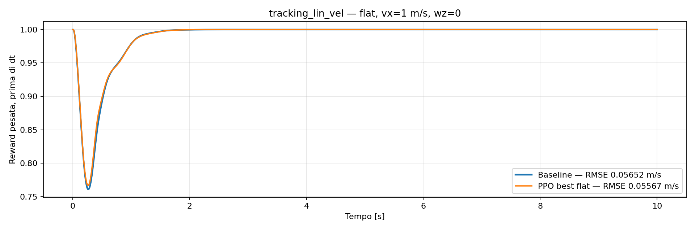
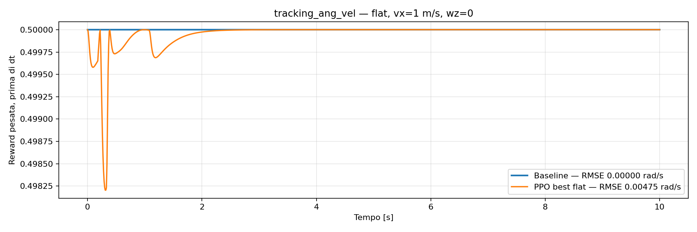

# Flat — reward di tracking: baseline contro residuale

Rollout deterministici del 7 ottobre 2026, senza ostacoli, stesso reset, rumore zero e stessi guadagni MPC/WBC. Comando vx=1 m/s, wz=0 con LPF 0,02. Durata 10 s; t=0 realmente registrato.

**Blu: baseline, azione zero. Arancione: residuale PPO, miglior checkpoint del training flat** `20261006_211344/params_best`, selezionato a 9.666.560 transizioni. Deadband 0,02. Non è la policy successivamente affinata sul singolo ostacolo. Nessun training eseguito per questo confronto.

L’RMSE in legenda è l’errore fra velocità misurata e comando filtrato contemporaneo, su tutti i campioni da 0 a 10 s, incluso il transitorio; non è un RMSE fra le reward. Per la velocità lineare riguarda vx, mentre la formula completa della reward include anche vy. Nessun nuovo rollout dopo il cambio della config: questi grafici conservano la deadband scalare 0,02 usata durante la registrazione.

## Tracking velocità lineare

## Tracking velocità angolare

## Contributi al ritorno sui 10 secondi

I grafici mostrano i contributi pesati prima di dt=0,01; la tabella somma i contributi delle transizioni dopo dt. Lo stato iniziale non aggiunge reward accumulata.

| Termine | Scaling | Baseline | Residuale | Differenza |
|---|---:|---:|---:|---:|
| tracking_lin_vel | 1 | 9.893192 | 9.896133 | +0.002941 |
| tracking_ang_vel | 0.5 | 5.000000 | 4.999549 | -0.000451 |

[Video baseline](../analysis_tita/runs/20261007_flat_comparison/baseline/rollout.mp4) · [Video residuale](../analysis_tita/runs/20261007_flat_comparison/residual/rollout.mp4)

[CSV baseline](../analysis_tita/runs/20261007_flat_comparison/baseline/rollout.csv) · [CSV residuale](../analysis_tita/runs/20261007_flat_comparison/residual/rollout.csv)

Il report completo precedente, con gli altri scenari, è conservato [qui](residual_training_setup_full_report.md).
